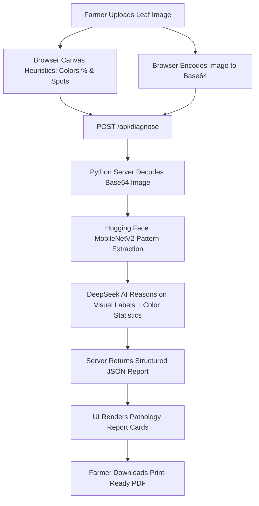

# 🌿 AI Farmer Assistant (Smart Agriculture Platform)

[](LICENSE)
[](https://www.python.org/downloads/)
[](https://www.deepseek.com/)
[](https://pytorch.org/)

An advanced, end-to-end digital advisory platform that acts as a pocket agronomist for farmers. By combining local canvas-based image heuristics, a backend Convolutional Neural Network (CNN), and a Large Language Model (LLM), the platform diagnoses crop leaf diseases, provides tailored organic/chemical treatment guides, and offers general farming advice.

---

## 📺 Walkthrough Demonstration

Below is a live walkthrough showing the platform selecting a crop, uploading a leaf image, executing the neural network pattern analysis, displaying the localized pathology report, and interacting with the Q&A Assistant:


---

## 🌟 Key Technical Highlights

*   **🧠 Dual-Stage AI Diagnosis Pipeline**:
    *   **Stage 1 (Computer Vision)**: A local **Google MobileNetV2** model runs on the Python backend via Hugging Face Transformers to analyze leaf texture, spot geometry, and patterns.
    *   **Stage 2 (Reasoning & Advice)**: A browser-derived pixel color analysis (calculating Green, Yellow, Brown, and Black distributions) is combined with the MobileNet class prediction and sent to **DeepSeek AI** to formulate highly specific pathology reports.
*   **🌾 Multi-Functional Farming Advisory**:
    *   Diagnoses crop diseases instantly.
    *   Provides actionable organic controls, chemical prescriptions (with exact dosages), and prevention steps.
    *   Features a Crop AI Assistant to answer general questions about soil health, fertilizers, weather, and crop rotation.
*   **🛡️ Agricultural Safety Guardrails**:
    The built-in chat assistant contains hardcoded prompt constraints. It dynamically declines off-topic questions (answering with a standardized refusal message) to maintain its utility as a dedicated agricultural utility.
*   **📄 Clean, Print-Ready Layout**:
    Generates structured, elegant physical prints or PDF reports of diagnostic results with one click.

---

## ⚙️ Technical Architecture & Data Flow



---

## 🛠️ Technology Stack

*   **Frontend**: HTML5, Vanilla JavaScript, Tailwind CSS (Styling), FontAwesome (Icons)
*   **Backend**: Python (Native http.server, socketserver)
*   **Machine Learning**: PyTorch, Hugging Face Transformers, MobileNetV2 Image Classifier
*   **Generative AI**: DeepSeek API
*   **Image Processing**: Pillow (PIL), Canvas API

---

## 🚀 Installation & Local Setup

### 1. Clone the Repository
```bash
git clone https://github.com/Sunil-Gajula25/Farmer_Bot.git
cd Farmer_Bot
```

### 2. Install Dependencies
Ensure you have Python 3.8+ installed, then run:
```bash
pip install torch transformers pillow python-dotenv
```

### 3. Configure the Environment
Create a `.env` file in the root directory and add your DeepSeek API key:
```env
DEEPSEEK_API_KEY=your_actual_deepseek_api_key_here
```
*(Note: The `.env` file is excluded from git tracking via `.gitignore` to protect credentials.)*

### 4. Run the Application
Start the Python server:
```bash
python server.py
```
Open your browser and navigate to:
```
http://localhost:8000/
```
